pdf-layout-analysis
==========================

# 0. 언어 정의
    * layout -analysis 
        * In computer vision, document layout analysis is the process of identifying and categorizing the regions of interest in the scanned image of a text document.
        * 문서 레이아웃을 분류하고 식별하는 과정
    * document
        * text와 image 또는 chart로 이루어진 파일
            * 주로 pdf
            * 필요시 word, hwp -> pdf 변환 프로그램 개발 
# 1. 목적
    * text의 청각화 또는 OCR (Optical character recognition)에 활용하기 위한 모델 개발 
# 2. 요구 사항
    * 단 (열) classification
        * 논문, 공문서 등 대부분의 document가 1단 또는 2단으로 구성되어 있음
        * 문서 편집 툴인 word에서는 최대 12단 편집 기능 제공
    * docuemnt 전처리
        *  skew correction
            * 좌우 균형이 맞지 않는 document 존재 가능성
        * noise removal
        * background separation
    * document layout point calculation
    * reading order for document calculation
# 3. 운영 환경
    * OS  : Microsoft Windows 버전 1803 (OS 빌드 : 17134.829)
    * CPU : intel i5-8250U CPU @  1.60GHz
    * RAM : 4 GB
# 4. 개발 환경
    *  운영 환경과 동일
# 5. 사용 언어
    * python
        * Python 3.7.3
# 6. 프로세스

# 7. 진행 상황
| step| 내용| 날짜 | 결과 |
|:---:|:---:|:---:| :---:|
| 1 | Make block of contents | 2019.07.15 | |
| 2 | Valid block detection based on dilate repetition rate  | 2019.07.17 | dilate repetition rate  == 1 : 이미지와 캡션 분리 가능, == 2 : 이미지와 캡션 분리 불가능|
| 3 | Valid block detection based on consecutive pixel position checker value change of RLSA  | 2019.07.17 |consecutive pixel position checker value : value와 contents block의 size는 정비례,   일정 range를 벗어나면 image와 text를 구분하는   contents block 생성 불가능 4어절 이상, 문단에 적합 |
## Valid block detection based on parameter change of RLSA and dilate repetition rate
| 순서 | consecutive pixel position checker value  | dilate repetition rate | text 최소 크기| text 평균 | text 최대 크기 | 이미지 |
|:---:|:---:|:---:| :---:|:---:|:---:| :---:|
| 1 | 1 | 1 |  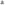  | | | 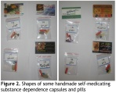|
| 2 | 1 | 2 |    | 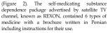| | 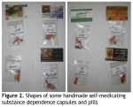|
| 3 | 5 | 1 |    | 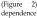| 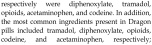| |
| 4 | 5 | 2 |  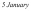  | 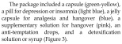| | 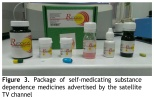|
| 5 | 10 | 1 |   | | 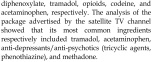| 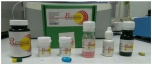|
| 6 | 10 | 2 | 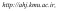  | | 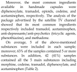| |
| 7 | 20| 1 |    | 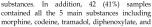| 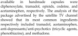| |
| 8 | 40 | 1 |   | | | |
| 9 | 100 | 1 |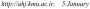  | 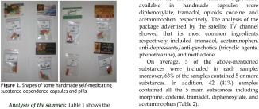| 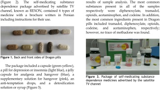| |
<pre>* 테스트 문서 : Khoddami-Vishteh HR, Narenjiha H, Noori R, Olyaei A, Fard-Sanei A, Fekri M, Farhoudian A. Component Analysis of the Illegal Handmade Pills and Capsules for Self-Medicating Substance Dependence in Tehran, Iran. page (3)
* 2480 x 3508 크기의 원본을 400 * 600 크기로 변환 후 테스트한 결과
* 문서 크기에 따른 결과의 차이가 있을 수 있으니 추가 실험이 필요함
</pre>
